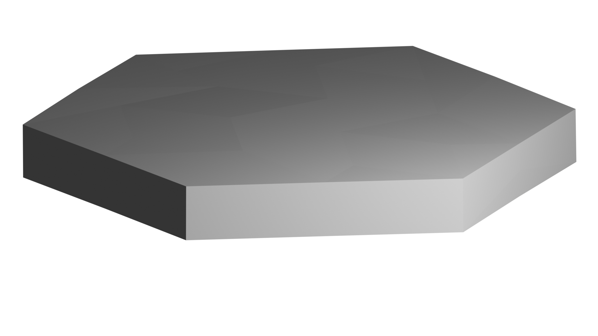

# Backscattering Case Study

This example demonstrates computing backscatter properties for ice crystals using GOAD, which is particularly relevant for lidar remote sensing applications.

## Setup

Set up a Python 3.11 virtual environment and install the required packages:

```bash
mkdir -p examples/backscattering
cd examples/backscattering
python3.11 -m venv .venv
source .venv/bin/activate
pip install bpy==4.5.3
pip install git+https://github.com/hballington12/bpy-geometries.git
pip install goad-py
```

## Generating Geometries

We'll create a roughened hexagonal plate - a 50 micron plate with aspect ratio 0.1:

- Radius: 25 microns
- Length: 5 microns (50 × 0.1)
- Max edge length: 15 microns (keep this large - at least 20% of particle size and several times the wavelength; too small means slower computation and less accurate results)
- Displacement sigma: 0.1 (subtle roughness)

Create `generate_plate.py`:

```python
"""Generate a roughened hexagonal plate for backscattering simulation."""

import bpy  # must import first to make bmesh available

from pathlib import Path
from bpy_geometries import HexagonalColumn, Roughened

output_dir = Path(__file__).parent

# 50 micron plate with aspect ratio 0.1
# radius = 25 microns, length = 5 microns
plate = Roughened(
    HexagonalColumn(length=5.0, radius=25.0, output_dir=output_dir),
    max_edge_length=15.0,
    displacement_sigma=0.1,
    merge_distance=1.0,
)

filepath = plate.generate()
print(f"Generated geometry: {filepath}")
```

Run it:

```bash
python generate_plate.py
```

This produces an OBJ file with the roughened plate geometry.



> `roughened_edge15.0_sigma0p1_merge1p0_hexagonal_column_l5.0_r25.0_6904c8.obj`

## Running the Simulation

*Coming soon...*

## Results

*Coming soon...*
