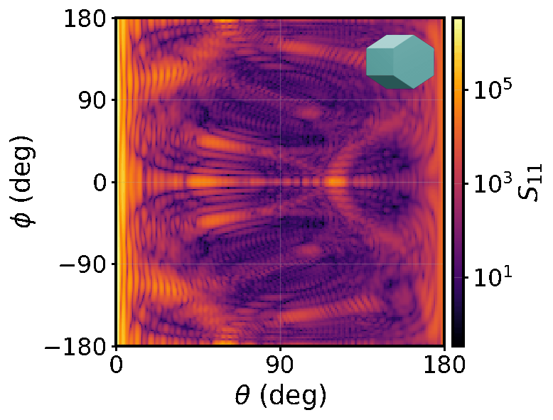

# Fixed-Orientation Scattering Patterns



With a little work, it's possible to generate 2D fixed-orientation scattering patterns. This example shows one possible way of doing this. Intensity is the usual quantity of interest but, since GOAD computes the full Mueller matrix, polarimetric quantities are also possible.

## Setup

<!-- TODO: one-line description of the working directory. -->
The usual stuff... Create a directory to work in, install the GOAD package from the Python distribution however you like.

```bash
mkdir -p examples/fixed-orientation-patterns
cd examples/fixed-orientation-patterns
```

=== "venv"

    ```bash
    python3.11 -m venv .venv
    source .venv/bin/activate
    pip install goad-py
    ```

=== "conda"

    ```bash
    conda create -n goad-fixed-orient python=3.11 -y
    conda activate goad-fixed-orient
    pip install goad-py
    ```

=== "uv"

    ```bash
    uv venv --python 3.11
    source .venv/bin/activate
    uv pip install goad-py
    ```

## Geometry

Here, the smooth hexagonal column is used as a simple example geometry.

## Imports

Some imports for the actual code.

{{ code_block('examples/fixed_orientation_patterns', 'imports') }}

## Orientations

Set up the orientations that should be looped over.

{{ code_block('examples/fixed_orientation_patterns', 'orientations') }}

## Config

Define the job config. Edit as needed.

One or more zones can be configured to control where the far-field is computed and at what angular resolution.

{{ code_block('examples/fixed_orientation_patterns', 'zones') }}

The full job settings:

{{ code_block('examples/fixed_orientation_patterns', 'settings') }}

## Looping over orientations

Loop over orientations, running a single-orientation GOAD computation for each. `save()` takes an optional argument where you can choose the name of the output directory.

>Note: While `MultiProblem` is the naming convention, in general you can choose whether the solve is a single or an average over multiple orientations.

{{ code_block('examples/fixed_orientation_patterns', 'loop') }}

Run it:

```bash
python fixed_orientation_patterns.py
```

<!-- TODO: brief note on what gets written under each `runs/orient_NNNN/`
(zone subdirs, mueller_scatgrid 2D files, results.json, settings.json). -->

## Results

Each call to `save()` creates an output directory containing the scattering results for a particular orientation.


